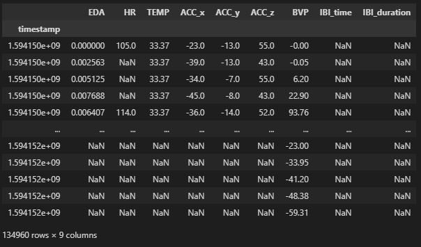

# data-mining-project

#### Findings from multi-modal dataset exploration

Each sensor readings are obtained at various sampling rates ranging from 1 Hz - 64 Hz

| Signal      | Signal_code | Frequecy(Hz)|
| ----------- | ----------- | ----------- |
| Heart Rate  | HR | 1.0 |
| Electrodermal Activity   | EDA | 4.0 |
| Skin Temperature   | TEMP | 4.0 |
| Accelerometer   | ACC | 32.0 |
| Inter-Beat Interval   | IBI | 64.0 |
| Blood Volume Pulse   | BVP | 64.0 |

For a selected NurseID contains several timestamped records but concatinating them without resampling causes a sparse dataset with NaN values

For comparison and stress analysis need to define a common sampling rate to synchronize the signals. 

- Possible approaches are upsampling/downsampling using interpolation methods.
- Align signals with timestamps
- Apply normalization to bring the signals to a common scale
- Decide on a optimal frequency for all signals as a trade-off between accuracy (higher the frequency better) and  computation time (lower the frequency better)

